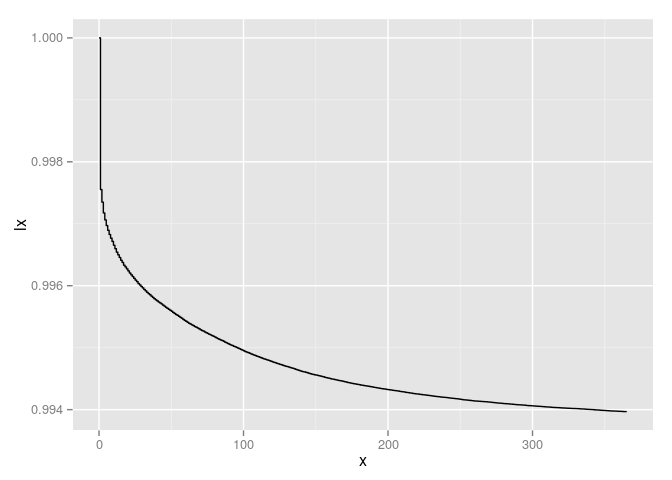
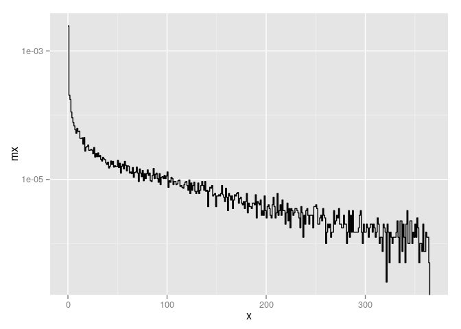
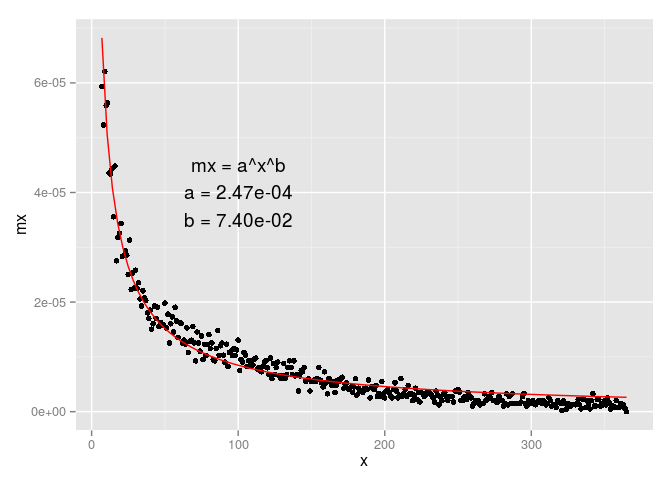

# Microdata Analysis of the Infant Mortality Age Pattern
Jonas Schöley  
October 15, 2015  

> - In the 2010 US birth cohort 40.6 % of all infant deaths happen at the day of birth, 52.6 % during the first week of life.
> - During the first 50 days of life the decline in infant mortality rates is faster than exponential. After 50 days the decline settles at a constant exponential rate.


This analysis describes the age pattern of infant mortality in days over the first year of life for the 2010 US birth cohort. We use publicly available individual-level data from the *National Center for Health Statistics* on births and infant deaths on US territory for the 2010 birth cohort.^[ftp://ftp.cdc.gov/pub/Health_Statistics/NCHS/Datasets/DVS/cohortlinkedus/] The data used in this article has been pre-selected and formatted by the author.


```r
library(dplyr)
library(tidyr)
library(lubridate)
library(ggplot2)
library(survival)

load("./data/usc10infant.Rdata")
usc10infant
```

```
## Source: local data frame [4,007,105 x 5]
## 
##    DOB_YY DOB_MM COMBGEST    SEX  AGED
##     (int)  (int)    (int) (fctr) (int)
## 1    2010      1       39   Male    NA
## 2    2010      1       39 Female    NA
## 3    2010      1       44 Female    NA
## 4    2010      1       40 Female    NA
## 5    2010      1       41 Female    NA
## 6    2010      1       41   Male    NA
## 7    2010      1       39   Male    NA
## 8    2010      1       43   Male    NA
## 9    2010      1       42 Female    NA
## 10   2010      1       37 Female    NA
## ..    ...    ...      ...    ...   ...
```

The 2010 US birth cohort has a size of 4,007,105. During their first year of life 24,174 infants of that cohort died.

In order to analyze the age pattern of infant mortality we calculate exposures and deaths by days. To do so we tabulate our microdata using the `surfit` function of the `survival` package. The survival time until death is given by the variable `AGED` (age at death in days). An observation is censored at 365 days if no death occurred until then.


```r
# construct survival analysis variables
usc10infant %>%
  mutate(
    # survival event death
    surve_death = ifelse(is.na(AGED), 0, 1),
    # survival time until death or censoring
    survt_death = ifelse(surve_death == 0, 365, AGED)
  ) -> usc10infant_anly

# we use the survfit function to get age-specific exposures
# and deaths from the microdata in order to construct a lifetable
usc10infant_surv <- Surv(time  = usc10infant_anly$survt_death,
                         event = usc10infant_anly$surve_death,
                         type  = "right")
# total population
usc10infant_survfit <- survfit(usc10infant_surv ~ 1)
```

Now that we tabulated the data according to deaths and exposures by day we can construct a cohort lifetable for infants by day.


```r
#' Construct a Cohort Lifetable from a Survfit Object
CohortLifetable <- function (survfit_object) {
  data_frame(
    x    = survfit_object$time,
    Dx   = survfit_object$n.event,
    Nx   = survfit_object$n.risk,
    mx   = Dx / Nx,
    qx   = mx,
    px   = 1-qx,
    lx   = c(1, cumprod(px[-length(px)])),
    dx   = Dx / sum(Dx)
  )
}

# build lifetables
usc10infant_lifetable <- CohortLifetable(usc10infant_survfit)
```

40.6 % of all infant deaths during the first year of life happen at the day of birth, 52.6 % during the first week of life.


```r
# survival curve
ggplot(usc10infant_lifetable, aes(x = x, y = lx)) +
  geom_step()
```

 

During the first 50 days of life the decline in infant mortality rates is faster than exponential. After 50 days the decline settles at a constant exponential rate.


```r
# mortality rates log transformed y scale
ggplot(usc10infant_lifetable, aes(x = x, y = mx)) +
  geom_step() +
  scale_y_log10()
```

 


```r
ggplot(filter(usc10infant_lifetable, !(x %in% 0:6)), aes(x = x, y = mx)) +
  geom_line()
```

 


```r
usc10infant_lifetable %>%
  filter(!(x %in% 0:6)) %>%
  nls(data = .,
      formula = mx ~ a^x^b,
      start = list(a = 0.1, b = 0.1),
      weights = Nx) %>% coef() -> usc10infant_coef

# mortality rates starting week 1 fitted with double exponential curve
ggplot(filter(usc10infant_lifetable, !(x %in% 0:6)), aes(x = x, y = mx)) +
  geom_point() +
#   geom_smooth(method = "nls", formula = y ~ a^x^c, start = list(a = 0.1, c = 0.1),
#               se = FALSE, colour = "red") +
  stat_function(fun = function (x, a, b) {a^x^b},
                args = list(a = usc10infant_coef["a"],
                            b = usc10infant_coef["b"]),
                colour = "red") +
  annotate(geom = "text", x = 100, y = 4e-05,
           label = paste0("mx = a^x^b\n",
                          paste0(paste(names(usc10infant_coef),
                                       "=",
                                       format(usc10infant_coef,
                                              scientific = TRUE,
                                              digits = 3)),
                                 collapse = "\n"))
  )
```

 

